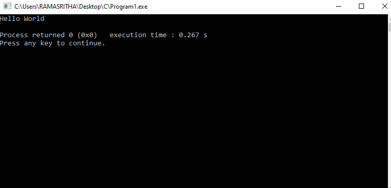

# Program 1

## Aim of the Experiment
To write a C program that contains a string (char pointer) with a value ‘Hello world’. The program should XOR each character in this string with 0 and displays the result.

### Output
 
 #### XOR

