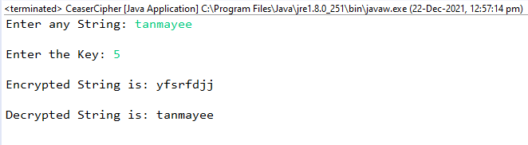

## Aim
Write a Java program to perform encryption and decryption using the following algorithms a. Ceaser Cipher b.Substitution Cipher c.Hill Cipher

## Output
## Ceaser Cipher

## Substitution Cipher

## Hill Cipher

